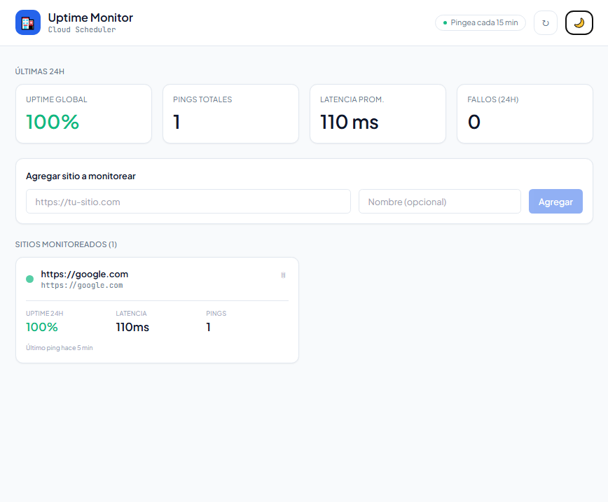
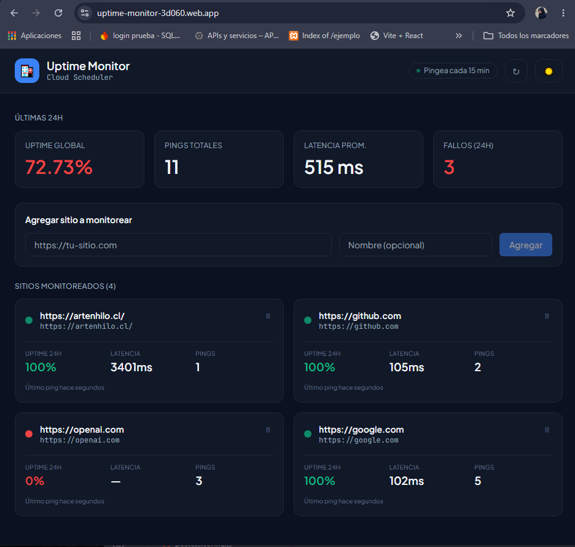
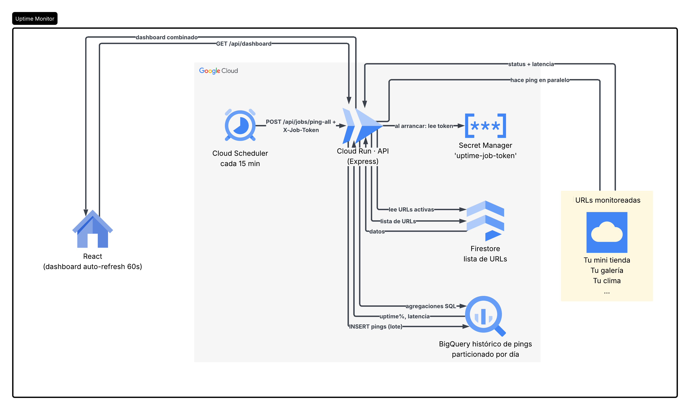
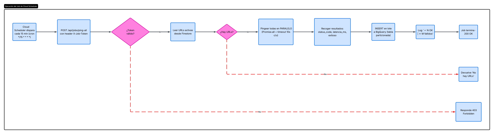
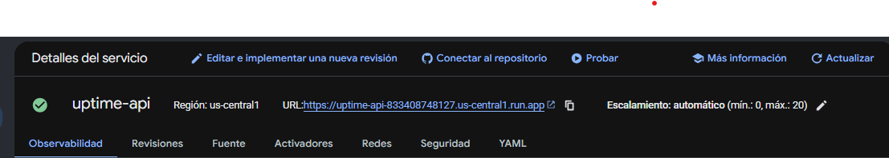
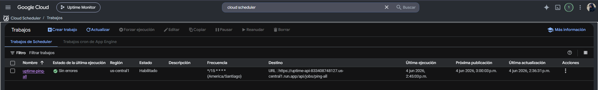
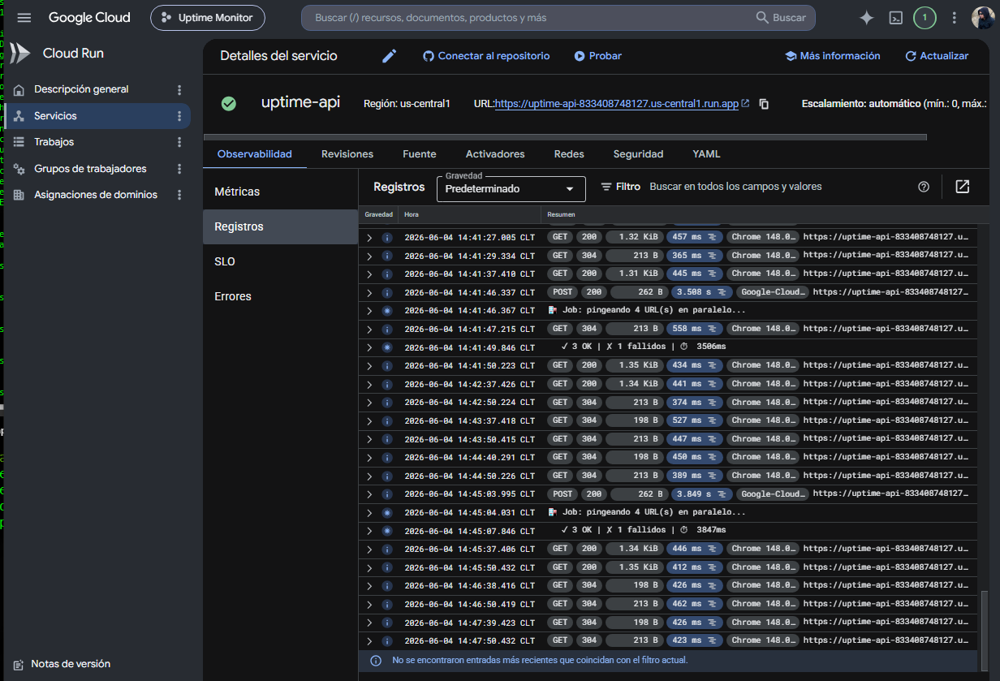
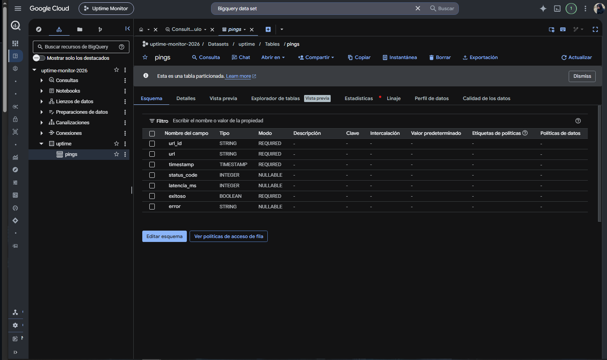
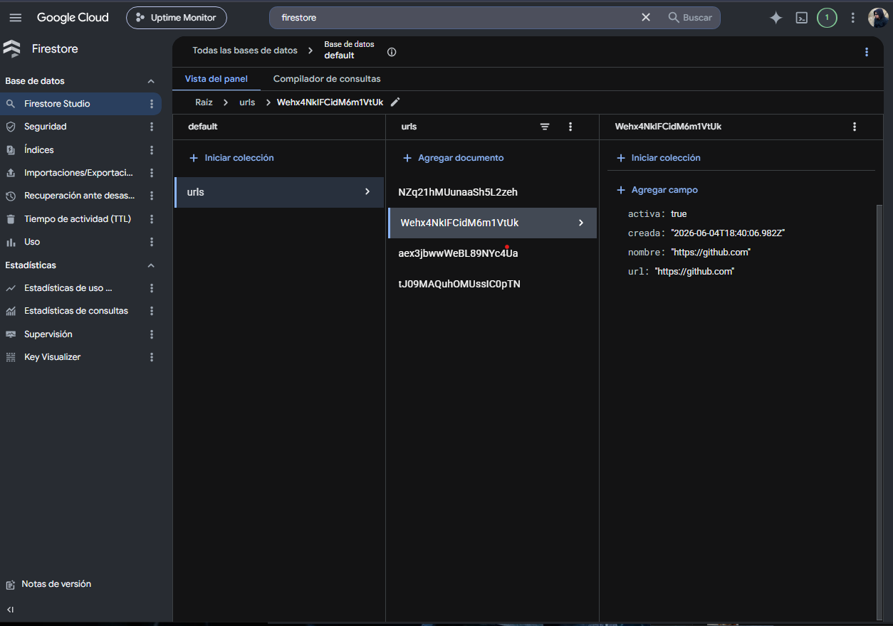
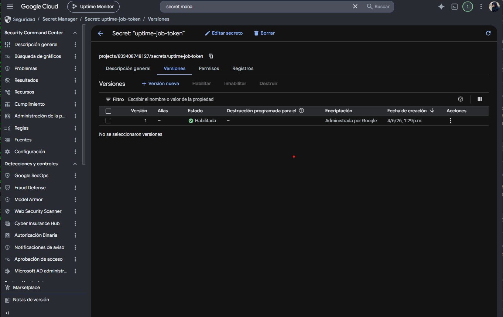

# Uptime Monitor — Tareas programadas con Cloud Scheduler

Aplicación fullstack desplegada en producción. Monitor de disponibilidad de sitios web que pingea URLs automáticamente cada 15 minutos. Cloud Scheduler dispara el job, los resultados se almacenan en BigQuery y la lista de URLs en Firestore.

**Demo en vivo:** https://uptime-monitor-3d060.web.app

---

## Vista previa

| Modo claro | Modo oscuro |
|-----------|-------------|
|  |  |

---

## ¿Qué hace?

- Agrega URLs a monitorear desde el dashboard
- **Cloud Scheduler** las pingea automáticamente cada 15 minutos
- Semáforo por URL (verde / rojo) según su uptime en las últimas 24h
- KPIs globales: uptime global, latencia promedio, total de pings, fallos
- Auto-refresh del dashboard cada 60 segundos

---

## Stack

| Capa | Tecnología |
|------|-----------|
| Frontend | React 18 · Vite · Tailwind CSS |
| Backend | Node.js 20 · Express |
| Programador | Google Cloud Scheduler |
| Base de URLs | Google Firestore |
| Histórico de pings | Google BigQuery |
| Secretos | Google Secret Manager |
| Cómputo | Google Cloud Run |
| Hosting frontend | Firebase Hosting |

---

## Arquitectura

```
Cloud Scheduler (*/15 * * * *)
         │
         ▼ POST /api/jobs/ping-all + X-Job-Token
         │
   Cloud Run (uptime-api)
         ├── lee URLs activas ────→ Firestore
         ├── pingea en paralelo ──→ sitios web
         └── guarda resultados ───→ BigQuery
                                        │
   React (auto-refresh 60s) ←──── /api/dashboard
```

### Diagrama del sistema


### Flujo del job


---

## Evidencia de despliegue

### Servicio activo en Cloud Run



### Cloud Scheduler — job activo



### Logs en producción — jobs ejecutándose



### BigQuery — tabla de pings



### Firestore — colección de URLs



### Secret Manager — token del job



---

## Estructura

```
07-uptime/
├── backend/
│   ├── index.js                       Arranque + lectura de token desde Secret Manager
│   ├── scripts/setup-bigquery.js      Crea dataset y tabla particionada en BigQuery
│   └── src/
│       ├── middleware/autenticarJob.js Valida X-Job-Token — solo Scheduler pasa
│       ├── services/
│       │   ├── secretos.js            Cliente de Secret Manager con caché
│       │   ├── urlsRepo.js            CRUD de URLs en Firestore
│       │   ├── pingsRepo.js           Insert + queries analíticas en BigQuery
│       │   └── pinger.js              Ping con AbortController y timeout de 10s
│       └── controllers/
│           ├── jobController.js       Endpoint que dispara Cloud Scheduler
│           ├── dashboardController.js Combina Firestore + BigQuery
│           └── urlsController.js      CRUD del frontend
└── frontend/
    └── src/
        ├── components/                KpisGlobales, TarjetaUrl, FormularioUrl
        ├── hooks/useDashboard.js      Auto-refresh cada 60s
        └── App.jsx
```

---

## Correr en local

**Backend**
```bash
cd backend
npm install
gcloud auth application-default login
gcloud auth application-default set-quota-project uptime-monitor-2026
npm run setup-bq   # solo la primera vez
npm run dev        # http://localhost:8080
```

**Frontend**
```bash
cd frontend
npm install
npm run dev   # http://localhost:5173
```

**Disparar el job manualmente**
```bash
curl -X POST http://localhost:8080/api/jobs/ping-all -H "X-Job-Token: TU_TOKEN"
```

---

## Endpoints de la API

| Método | Ruta | Acción | Quién la llama |
|--------|------|--------|----------------|
| GET | `/api/dashboard` | KPIs + lista con métricas | Frontend |
| GET | `/api/urls` | Lista URLs | Frontend |
| POST | `/api/urls` | Agrega URL | Frontend |
| DELETE | `/api/urls/:id` | Elimina URL | Frontend |
| POST | `/api/jobs/ping-all` | Pingea todas (protegido) | Cloud Scheduler |
| GET | `/health` | Estado del servicio | — |

---

## Decisiones técnicas

- **Cloud Scheduler vs `setInterval`**: Cloud Run escala a 0 cuando no hay tráfico, un `setInterval` nunca se ejecutaría. Cloud Scheduler está siempre activo e independiente del backend.
- **Token en Secret Manager**: las variables de entorno de Cloud Run son visibles en consola. Secret Manager tiene IAM granular y permite rotar el token sin tocar el código.
- **Firestore para URLs, BigQuery para pings**: Firestore es óptimo para bajo volumen con lecturas rápidas. BigQuery es óptimo para queries analíticas sobre millones de registros con agregaciones temporales.
- **`Promise.all` para pings en paralelo**: 10 URLs con timeout de 10s en serie tardarían 100s. En paralelo tardan lo que la más lenta.
- **`AbortController` con timeout**: evita que una URL caída bloquee el job entero esperando respuesta indefinidamente.
- **`SAFE_DIVIDE` en BigQuery**: evita división por cero cuando la tabla no tiene pings aún.
